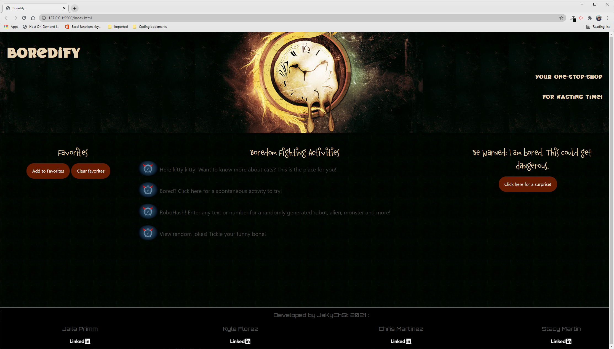

# Boredify!
## An app to cure boredness!

### Description

Do you ever feel bored out of your mind during a pandemic?! If the answer is yes, you can waste your hours away using Boredify! Want to know more about cats? Who doesn't?! Let us serve up a random cat fact at will to increase your grey matter! If you have Zoom fatigue or are just dazing off in a conversation, you can look up random jokes to tickle your funny bone! Use our random activity generator for something to do to break up the monotony of the day! Want to know what your robot alter-ego looks like? Try our RoboHash app to serve up an avatar based on your input!


### User Story
```
AS A Boredify user
I WANT to be presented with options to waste my time
SO THAT I can escape boredom
```

### Acceptance Criteria
```
GIVEN I need to escape my bored reality
WHEN I open the website
THEN I am presented with options to waste my time
WHEN I choose an option
THEN I am presented with an interactive way to use it
WHEN I get bored with my first activity choice
THEN I can select from several other ridiculous options
WHEN I find activities that are entertaining
THEN I can save them in a favorites list
WHEN I get bored with an activity
THEN I can delete it 
```

### Features
* Waste your time away with multiple activities designed to give you an escape from boredom!
    * View random jokes
    * View random cat facts
    * Create a robot avatar from any random characters
    * View a random activity to try
    * More to come! 
* Includes a random image generator to elicit a giggle on demand! 
* Found an activity you like? Save it to your favorites for easy access as site content grows!

### Technical details
* Utilized vanilla JavaScript and jQuery throughout to both provide functionality as well as build DOM elements
* Utilized Bulma CSS Framework as well as custom CSS for styling
* Utilized modals in place of alerts to improve the UX

### Challenges
* As a team, we faced challenges in styling to create the rich but simple user-friendly experience. Google-fu and support/input from other developers was key in overcoming these issues! 
* Javascript was a challenge with implimenting the different DOM elements as well as interfacing with localstorage. We overcame this by constantly doing research as well as by collaborating together


## Credits
Contributors
* [Chris Martinez](https://github.com/cbmartinez42)
* [Stacy Martin](https://github.com/Stacy-Martin)
* [Kyle Florez](https://github.com/SLUDGE-GIT)
* [Jaila Primm](https://github.com/JPrimm99)

Many thanks to the below individuals who provided input and suggestions
* Mim Armand
* Stephen Simone
* Kat Poulos
* And last, but not least - *Grogu*
        


---

This application is covered under [GNU General Public License v3.0](./LICENSE)

Published site:
[https://cbmartinez42.github.io/boredify-project/](https://cbmartinez42.github.io/boredify-project/)

Screenshots of wireframe:


Screenshot of published site:



