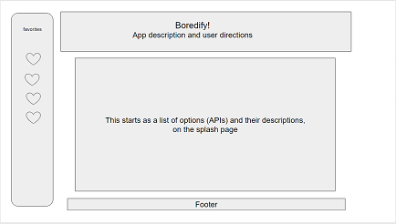
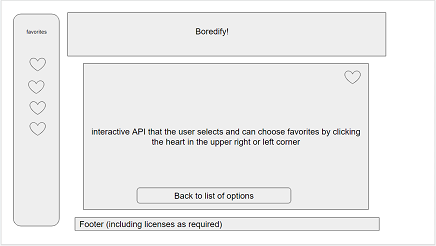
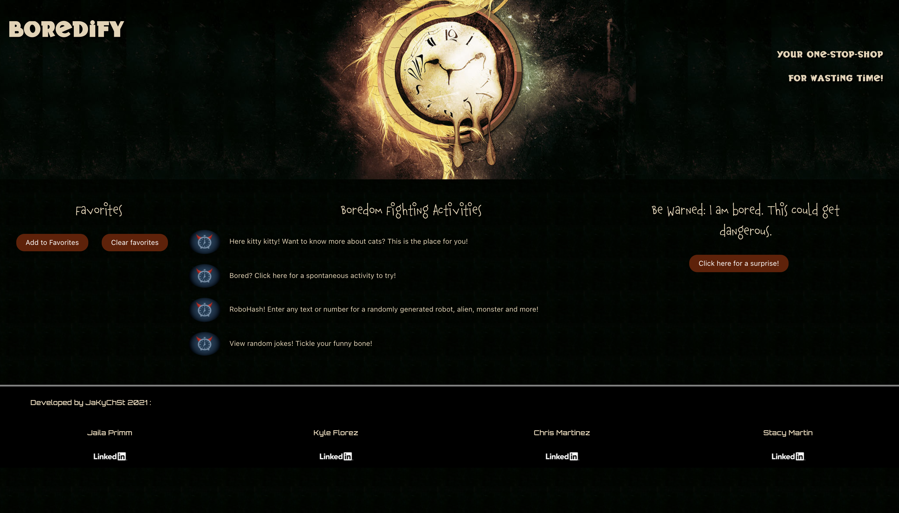

# boredify-project
An app to cure boredness!

## Description

Do you ever feel bored out of your mind during a pandemic!! If the answer is yes, you can waste your hours away using Boredify. Want to know more about cats? Who doesn't?! Let us serve up a random cat fact at will to increase your grey matter! If you have Zoom fatigue or are just dazing off in a conversation, you can look up random jokes to tickle your funny bone! Use our random activity generator for something to do to break up the monotony of the day! Want to know what your robot alter-ego looks like? Try our RoboHash app to serve up an avatar based on your input!


## User Story
```
AS A Boredify user
I WANT to be presented with options to waste my time
SO THAT I can escape boredom
```

## Acceptance Criteria
```
GIVEN I need to escape my bored reality
WHEN I open the website
THEN I am presented with options to waste my time
WHEN I choose an option
THEN I am presented with an interactive way to use it
WHEN I get bored with my first activity choice
THEN I can select from several other ridiculous options
WHEN I find activities that are entertaining
THEN I can save them in a favorites list
WHEN I get bored with an activity
THEN I can delete it 
```

APIs to be used: 
* Cat facts - Want to know more about cats? Get a random cat fact here! - https://alexwohlbruck.github.io/cat-facts/docs/
* Bored API - Get random activity to try to break the borednessocity! - https://www.boredapi.com/
* RobotHash - Enter any text or number for a randomly generated robot, alien, monster, etc. - https://robohash.org/
* Random Jokes - Get a random joke for giggles! - https://official-joke-api.appspot.com
* Superheroes - Search to learn more about any Superhero or Villain - https://superheroapi.com/

If we have time we will add additional APIs to make a more rich UX

---


Published site:
[https://cbmartinez42.github.io/boredify-project/](https://cbmartinez42.github.io/boredify-project/)

Screenshots of wireframe:




Screenshot of published site:

